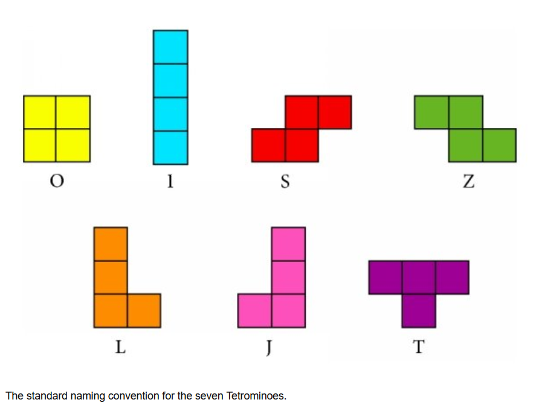

# 🎮  Un jeu vidéo : Tetris

Un jeu Tetris classique développé en C++ et avec un interface graphique et sonore disponible sur https://github.com/bonaventuredk/Tetris.

## Auteurs : 

    * Alexandre Bleuler 
    * Bonaventure Dohemeto


## Table des Matières

- [Description générale du jeu Tetris](#description-générale-du-jeu-tetris) 
- [Téléchargement, installation et dépendances](#téléchargement-installation-et-dépendances)
- [Jouer au jeu](#jouer-au-jeu)
- [Description des fonctionnalités du jeu](#description-des-fonctionnalités-du-jeu)
- [Implémentation du jeu](#implémentation-du-jeu)
- [Documentation](#documentation)
- [Tests](#tests)

##  Description générale du jeu Tetris

Tetris est un célèbre jeu-vidéo dont le but est d'obtenir le meilleur score possible en remplissant des lignes de blocs dans une grille. 

Pour ce faire, des pièces composées de quatre blocs (voir image ci-dessous) tombent depuis le haut de la grille et le joueur doit les déplacer pour les poser à l'endroit qu'il juge le plus approprié. Les déplacements possible sont vers le bas, la gauche et la droite. Des rotations horaires et anti-horaires sont également possibles. 

Lorsqu'une ligne est remplie, elle disparaît et les lignes du dessus descendent d'un cran. Si après disparition des lignes pleines un bloc de trouve toujours dans l'une des quatre plus hautes lignes de la grille, la partie est perdue !

<center>
<figure>
    
</figure>
</center>

## Téléchargement, installation et dépendances

Le jeu peut-être téléchargé ici : https://github.com/bonaventuredk/Tetris.

Pour ce qui est de l'installation du jeu, celle-ci est conçue pour être réalisée à l'aide de `CMake`, de préférence dans un dossier `/build` à la racine du dossier de téléchargement. Un fichier `CMakeLists.txt` est notamment fourni à cette fin. Une façon de de faire cela est d'utiliser dans un terminal à la racine du dossier de téléchargement les commandes :
```bash
mkdir build
cd build
cmake ..
```

De petites adaptations en fonction du système d'exploitation utilisé devront éventuellement être faites, notamment en ce qui concerne les dépendances suivantes qui doivent préalablement être installées et trouvables par `CMake` :
- la librairie `Catch2 version 3 (32 bits)`;
- la librairie `SFML version 3.0.2. (64 bits)`. 

## Jouer au jeu

Une fois l'installation réalisée, il suffit alors d'exécuter le fichier `tetrix_game`. Ce fichier se trouve à la racine de l'installation faite via `CMake` (donc dans le dossier `/build` avec les instructions précédentes). Une fenêtre en plein écran s'ouvrira alors et vous proposera de lancer une partie (touche `R` du clavier) ou de quitter le jeu (touche `Esc`).

Au cours d'une partie, les touches du clavier utilisables seront :
- `left arrow` pour bouger la pièce vers la gauche;
- `right arrow` pour bouger la pièce vers la droite;
- `down arrow` pour bouger la pièce vers le bas;
- `up arrow` pour faire une rotation de la pièce dans le sens anti-horaire;
- `space` pour faire une rotation de la pièce dans le sens horaire;
- et `P` pour mettre le jeu sur pause.

Finalement, mentionnons qu'un mouvement qui ferait sortir la pièce de la grille de jeu ne sera pas comptabilisé.

## Description des fonctionnalités du jeu

Outre la réalisation et la mise à l'écran des éléments clés du jeu décrits au paragraphe [Description du jeu Tetris](#description-du-jeu-tetris#-description) , le jeu fournit plusieurs menus qui permettent de lancer une nouvelle partie ou de quitter le jeu : un menu au démarrage du jeu, un menu pause permettant de figer l'état de la partie et enfin un menu de fin de partie.

Également, un affichage de la prochaine pièce à jouer est réalisé à droite de la grille du jeu. A sa gauche, l'affichage du score de la partie actuelle est également affiché de même que le meilleur score jamais réalisé pour cette installation du jeu. 

FInalement, en plus des diverses touches du clavier permettant de jouer au jeu, des effets sonores ainsi que des musiques d'ambiance ont été ajoutés. Cependant, le jeu ne possède pas de réglage interne du son. Celui-ci doit donc être ajusté directement avec le mélangeur de volumes de l'ordinateur. En particulier, il est recommandé de faire attention à la puissance du son lors du premier lancement du jeu, celui-ci pourrait être trop fort en l'absence de réglages préalables.

## Implémentation du jeu 

###  Aborescence des fichiers

        TetrisProject/
        │
        ├─── core/
        │ ├─── include/
        │ │ └─── core_class.h
        │ └─── src/
        │   ├─── core_class.cpp
        │   └─── main.cpp
        │
        ├─── doc/
        │
        ├─── tests/
        │ └─── test_core_class.cpp

        ├─── ui/
        │ ├─── include/
        │ │ └─── ui.h
        │ ├─── src/
        │ │ └─── ui.cpp
        │ ├─── sound/
        │ │ ├─── anticlockwise.wav
        │ │ ├─── clickleft.wav
        │ │ ├─── clickright.wav
        │ │ ├─── clockwise.wav
        │ │ ├─── drop.wav
        │ │ ├─── game_over.wav
        │ │ ├─── higherlevelup.wav
        │ │ ├─── music.ogg
        │ │ └─── success_linedisapear.wav
        │ └─── Tetris_font.ttf
        │
        ├─── .gitignore
        ├─── CMakeLists.txt
        ├─── DoxyFile
        ├─── README.md
        └─── tetrominoes_notations.png

### Brève description du core

Le dossier `/core` contient les fichiers permettant de de définir la logique du jeu. 

En particulier, les fichiers `core_class.cpp` et `core_class.h` contiennent respectivement les définitions et déclarations des quatre classes constituant le coeur de l'implémentation :
- `Block`
- `Piece`
- `Cell`
- `Grid`

`Block` est essentiellement un couple de coordonnées entières positives et sur lequel l'on peut faire des translations à partir du mouvement décrit tel qu'il apparaîtrait sur un écran. `Piece` est alors un agrégat de quatre blocs dont les positions relatives permettent de définir les formes décrites au paragraphe [Description générale du jeu Tetris](#description-générale-du-jeu-tetris). Une pièce possède également une méthode permettant de réaliser les mêmes types de mouvement que les blocs auxquels on ajoute les rotations horaires et anti-horaires autour d'un bloc pivot définit préalablement.

La classe `Cell` est quant à elle une classe réprésentant les cases d'une grille de jeu Tetris. Elle contient donc des attributs et méthodes donnant des informations sur la case : sa couleur et si elle est vide ou non. La classe `Grid` est alors un grille d'objets de type `Cell` et est l'interface du core du jeu. En particulier, une partie de Tetris est constitué d'itérations du type :
- la création de la prochaine pièce à jouer et son positionnement (méthode `put_piece` de `Grid`) ;
- le déplacement de la pièce jusqu'à qu'elle ne puisse plus descendre (méthode `move_piece` de `Grid`) ;
- la mise à jour de la grille avec la suppression des lignes pleines et la vérification de la fin de partie  (méthode `update` de `Grid`).

Précisons en outre le lien entre une pièce et une grilles. En effet, il s'avère que la pièce contrôlée par le joueur n'évolue pas directement dans la grille. Elle existe plutôt séparément et la grille actualise ses cellules en mettant en parallèle les coordonnées des blocks de la pièce et les index des cellules. 

Le premier avantage de cela est que cela facilite la vérification de la légalité des mouvements de la pièce. En effet, il faut que pendant une partie de Tetris la pièce ne sorte pas de la grille. La pièce ayant une existence indépendante de la grille, nous pouvons donc la déplacer sans s'en préoccuper dans un premier temps. Il est alors facile dans un second temps de vérifier en regardant directement les coordonnées des blocs de la pièce si celles-ci correspondent à des indices possibles de la grille et si les cellules correspondantes sont bien vides. Si ces deux choses sont vérifiées, le déplacement de la pièce est validé, sinon la pièce est remise à sa position initiale. De cette façon, si l'affichage graphique de l'état de la grille est réalisé après ces étapes, la pièce ne se sera pas déplacée pour le joueur en cas de mouvement illégal. 

Le deuxième avantage est que cela n'oblige pas à stocker les pièces tout au long de la partie mais juste à changer le caractère vide ou plein des cellules de la grille au fur et mesure. Il s'agit donc essentiellement de stocker un booléen au lieu d'un couple de `unsigned int`, ce qui est plus efficace en terme de mémoire.

Finalement, le core du jeu contient également le fichier `main.cpp` qui est comme son nom l'indique le fichier contenant la fonction `main`. II s'agit du fichier organisant l'ensemble du jeu, notamment en reliant l'interface du core, les objets de type `Grid` gérant la logique interne du jeu, à l'interface utilisateur permettant par exemple d'afficher le jeu à l'écran tel qu'attendu.

### Brève description de l'ui

Le dossier `/ui` contient les fichiers `ui.cpp`  et `ui.h` permettant de créer l'interface utilisateur de jeu à l'aide de la librairie `SFML`. Il s'agit essentiellement de la définition et la déclaration des :
- variables permettant de définir les caractéristiques de l'interface, comme par exemple la hauteur en pixels de l'écran, au sein du namespace `UI` ;
- des fonctions permettant de faciliter la manipulation de la librarie `SFML` dans la fonction `main` du jeu. 

Ces éléments permettent notamment de fournir un affichage plein écran qui s'adapte automatiquement à la résolution native de l'écran, par exemple pour le centrage des textes de menu ou sur les côtés de la grille. Mentionnons également que la police d'écriture utilisée tire sa source de https://fontstruct.com/fontstructions/show/2350408. 

Finalement, l'ui du jeu gère la diffusion de sons et musiquesd d'ambiance. Il n'y a cependant pas d'option de réglages des volumes sonores à l'intérieur du jeu. 
        

## Documentation 

La documentation des fichiers du jeu a été générée à l'aide de `Doxygen`. Les fichiers générés sont au format `html` ou `Latex` au sein du fichier `/doc`. Le format le plus simple à utiliser est le format `html` puisqu'il suffit de l'ouvrir dans un navigateur internet pour pouvoir en consulter le contenu.

La documentation générée permet d'obtenir l'ensemble des déclarations des éléments importants du jeu (classes, fonctions, namespace etc) ainsi qu'une brève description de ce que cela représente ou de ce que cela est censé accomplir.

## Tests

La core du jeu a été testé à l'aide de la librarie `Catch 2`. Cela a permis l'implémentation de tests systématiques des éléments clés de la logique interne du jeu. Ces tests sont exécutables en exécutant le fichier `test_core` qui a été crée au même endroit que `tetrix_game` lors de l'installation.

Les premiers tests sont simplement des vérifications sommaires de la méthode `move` de la classe `Block` ainsi que de l'attribution des couleurs des blocs d'une pièce en fonction de sa forme. Les autres tests, plus importants, consistent à tester la classe `Grid` puisqu'elle contient les fonctions d'interface du core. En outre, son bon fonctionnement valide également celui des autres classes puisqu'il en dépend. La philosophie de ces tests est la suivante : 
- on crée un objet de type `string` qui représente un état du jeu bien précis et dont l'état peut-être controlé au besoin en l'affichant dans le terminal;
- on recrée ensuite cet état du jeu à l'aide des méthodes de la classe `Grid` en supposant qu'elles fonctionnent correctement; 
- on transforme la grille en objet de type `string` à l'aide de la fonction auxiliaire `get_grid`;
- on réalise un test de comparaison entre les deux `string` ainsi obtenues : si le test est validé, c'est que les méthodes de la `Grid` en ont modifié l'état de la façon attendue, sinon c'est qu'il y a un problème à régler.   

<br/> 

En ce qui concerne l'interface utilisateur du jeu, l'utilisation de la librairie `Catch 2` est beaucoup plus difficile de par l'objectif même de cette partie du code, à savoir créer un affichage graphique ainsi qu'ajouter des musiques et effet sonores. Les tests ont donc été conduits plus élémentairement en jouant simplement au jeu pour vérifier le bon fonctionnement des éléments graphiques et sonores, le fonctionnement interne du jeu étant assuré par les tests systématiques du core.